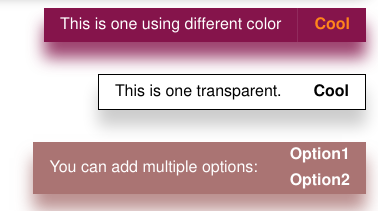

`<message-box/>`
================

`<message-box/>` is a Web component implemented on Lit-Element library.
It is similar to native HTML Element and could runs in mainstream browsers without any difference.

In short, it is a message string box and some buttons,
common application scenario is to convey to the website user some information.
For example:

```html
<message-box class="colorful" >
  <span slot="message">
    This is an example that contains only one option.
  </span>
  <button slot="button">Okay</button>
</message-box>
```

It looks like this:


Another common scenario is the progress bar.
Message-box has a progress bar via gradient background color:


More examples can be found [here](https://codepen.io/kingcc/pen/Pojwrgr).



### Usage

##### Import directly in HTML

npm CDNs like `unpkg.com` can directly serve files that have been published to npm. This works great for standard JavaScript modules that the browser can load natively.

So recommended ways of importing:

```html
<!-- Importing -->
<script type="module">
  import 'https://unpkg.com/@lit-component/message-box?module';
  ...
</script>
<!-- Using -->
<message-box .../>
```

Or:

```html
<!-- Importing -->
<script type="module" src="https://unpkg.com/@lit-component/message-box?module"></script>
<!-- Using -->
<message-box .../>
```

##### Import in project using Npm & Webpack

1. Installation via NPM
   
```sh
npm i @lit-component/message-box
```

2. Importing

In webpack entry script, usually, `index.js`:

```js
import '@lit-component/message-box'
```

In HTML:

```html
<message-box .../>
```

###	Attribute & Properties

You can set attributes for `<message-box/>` elements directly or properties for Web Component MessageBox instances, and they have the same effect:

```html
<message-box min-width="20vw"/>

<!-- Is equal to -->

<message-box/>
<script>
const $messageBox = document.querySelector('message-box')
$messageBox.minWidth = '20vw'
</script>
```

<table>
  <tr>
    <th>Property</th><th>Attribute</th><th>Description</th><th>Type</th><th>Default</th>
  </tr>

  <tr>
    <td>height</td><td>height</td><td>The height of component</td><td>string</td><td>"initial"</td>
  </tr>

  <tr>
    <td>width</td><td>width</td><td>The width of component</td><td>string</td><td>"initial"</td>
  </tr>

  <tr>
    <td>minWidth</td><td>min-width</td><td>The min-width of component</td><td>string</td><td>"initial"</td>
  </tr>

  <tr>
    <td>border</td><td>border</td><td>The `border` css property of component</td><td>string</td><td>"0"</td>
  </tr>

  <tr>
    <td>color</td><td>color</td><td>The `color` css property of component</td><td>string</td><td>"255, 255, 255"</td>
  </tr>

  <tr>
    <td>radius</td><td>radius</td><td>The `border-radius` of component</td><td>string</td><td>"0"</td>
  </tr>

  <tr>
    <td>shadow</td><td>shadow</td><td>The `box-shadow` css property of component</td><td>string</td><td>"0, 1rem, 1rem"</td>
  </tr>

  <tr>
    <td>out</td><td>out</td><td>The out method of component. one of "right"|"top".</td><td>string</td><td>""</td>
  </tr>

  <tr>
    <td>timeout</td><td>timeout</td><td>The display time of the component.</td><td>string</td><td>"0"</td>
  </tr>
  
</table>

    
### Slots

<table>
  <tr>
    <th>Name</th><th>Description</th>
  </tr>
  
  <tr>
    <td>message</td><td>The 'message' component that needs to be displayed, the most basic such as `SPAN`</td>
  </tr>

  <tr>
    <td>button</td><td>`BUTTON`s that need to be displayed</td>
  </tr>
  
</table>

    
### CSS Shadow Parts

<table>
  <tr>
    <th>Name</th><th>Description</th>
  </tr>
  
  <tr>
    <td>--message-box-background-color</td><td>Set background color of component</td>
  </tr>

  <tr>
    <td>--message-box-opacity</td><td>Set opacity of component</td>
  </tr>
  
</table>